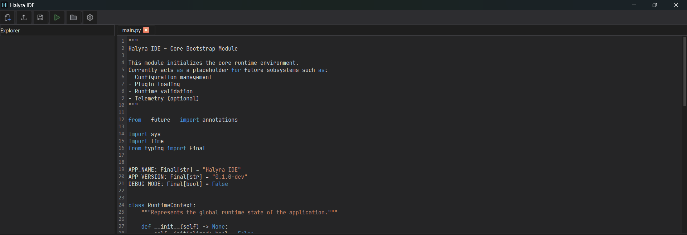

# Halyra IDE

**Halyra IDE** is an open-source Python IDE currently in development.  
Built with **PyQt6**, it focuses on simplicity, performance, and essential tools for Python developers.
---

## Features

- **Tab-based editor**
  - Closable & movable tabs
  - Rename tabs
- **Python syntax highlighting**
  - Powered by `PythonHighlighter`
- **Code autocompletion**
  - Implemented directly in `CodeEditor`
- **Line numbers**
  - Current line highlighting
- **File operations**
  - New file
  - Open
  - Save / Save As
- **Project / folder explorer**
  - Tree view
  - Filters out:
    - Hidden files
    - `__pycache__`
    - `venv`
- **Code execution**
  - Run Python scripts with **F5**
  - Live output
- **Interactive console / terminal**
  - Full `stdin` support
- **Process management**
  - Prevents running multiple scripts at the same time

---
### Main Editor


## 🚀 Getting Started

### Requirements

- **Python 3.13**
- **PyQt6**

Install PyQt6:
```bash
pip install PyQt6
```
To Run:
```bash
python main.py
```
In other cases you may need to use `python3` or `py` instead of `python`, you could also download the exe in the release tab(only for windows, sadly)
*Its a lot more recommendable to use source script than using exe as various issues had been reported, althouhg the exe works the same, it gets buggier


